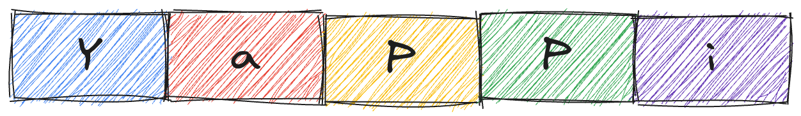

    

> <a href="https://yappy.media">YaPPi</a> search pipeline by <a href="https://polaroids.ai">polaroids.ai</a>

- [Information Retreval](#information-retreval)
- [Tech.Stack](#techstack)
- [Installation](#installation)
- [Searching](#searching)
- [Finetuning](#finetuning)
- [Clustering](#clustering)
- [Papers](#papers)
- [Code Style](#code-style)

# Information Retreval

> Information retrieval - <a href="https://en.wikipedia.org/wiki/Information_retrieval">IR</a> is one of the most "in-demand" subtask. In many search systems the `IR` part is implemented as a separate component `R` that narrows down the search form billions to, let's say, `k=5` candidates.

> We use two-stage pipeline. First, we observe there're three types of videos according to the given distribution (below).

_counts_curve.png)

> First type of videos are those, that are `speechless` - e.g. a beatuful sunset. Second - short but consise (e.g. math tutoring). Last but not least - moments (aka polaroids) from movies, games, books. We focuse on the last two types of videos. Those that have audio and could be transcribed / translated in correct format.

> We sample `top_k` videos according to `tag` distribution provided by users, capture semantics via optimized <a href="https://github.com/SYSTRAN/faster-whisper">FasterWhisper</a> model (<a href="https://en.wikipedia.org/wiki/Speaker_diarisation">diarisation</a>) and maps the textual description to the Euclidean space. Examples below:

<a href="https://youtu.be/JR1Zm1s6hc8?si=uE2b-dCJ79q36Qfo">Голодные игры 2012 (trailer 1)</a>

<a href="https://youtu.be/A-mCKNTU_mU?si=YujJBomQxQvr6MB4">Ведьмак 3: Дикая охота (trailer 1)</a>

# Tech.Stack

> We use <a href="https://github.com/Lightning-AI/pytorch-lightning">pytorch-lightning</a> wrapper to fine-tune semantic models, logging metrics to <a href="https://wandb.ai/site">wandb</a>, clustering via <a href="https://maartengr.github.io/BERTopic/index.html">BERTopic</a>, data exploration using <a href="https://pola.rs">polars</a> and visualize everything via <a href="https://plotly.com/python/">plotly</a>

# Installation

1. Start <a href="https://weaviate.io">weaviate</a>(ANN), <a href="https://rethinkdb.com">RethinkDB</a> and, of course, <a href="https://redis.io">redis</a> services by running `docker-compose up -d`.
2. Second, install the dependencies by `pip install -r requirements.txt`
3. Export your `QUART_APP`="yasearch.api.run" environment variable.
4. `quart run`

# Searching

> ANN search engine: <a href="https://github.com/weaviate/weaviate">Weaviate</a> who supports hybrid search out of the box and <a href="https://weaviate.io/developers/weaviate/search/hybrid#balance-keyword-and-vector-search">Relative Score Fusion</a> ranking algorithm.

# Finetuning

> TODO

# Clustering

> TODO 

# Papers

| Paper                                   | Description                                                                                                  |                                  Github(Notebook) |
| :-------------------------------------- | :----------------------------------------------------------------------------------------------------------- | ------------------------------------------------: |
| [DPR](https://arxiv.org/abs/2004.04906) | Semantic search using two separate encoders for each source of information. SOTA in 2021. Easy to implement. | [github](https://github.com/facebookresearch/DPR) |

# Code Style

We use <a href="https://pypi.org/project/flake8-black/">flake8-black</a> for code style formatting and follow <a href="https://google.github.io/styleguide/pyguide.html">Google code style</a>.